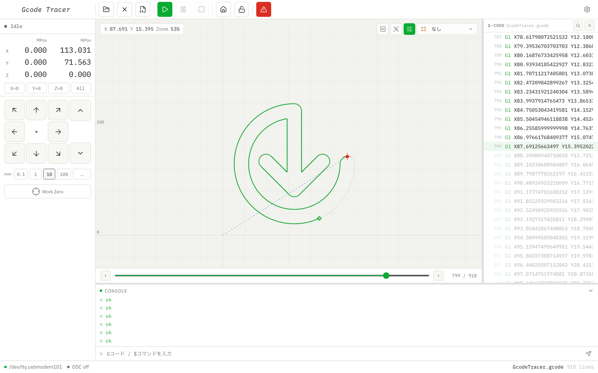

# Gcode Tracer · v0.1.0

macOS 向け GRBL G-code Sender。Electron + Vue 3 + Pinia で構築されています。

主にペンプロッターの使用を想定しています。また、OSC通信による外部アプリへの機械位置の送信が可能です。

このアプリケーションは『[Trace Attribute](https://vimeo.com/1150657891)』の制作に際して開発されたものです。

> **動作環境**: macOS (Apple Silicon / arm64) のみ

---

## スクリーンショット


動作イメージ

---

## 機能

- **シリアルポート接続** — ポート一覧取得・ボーレート選択・接続/切断
- **リアルタイム状態表示** — マシン状態 (Idle / Run / Hold / Alarm)・MPos / WPos 座標
- **ジョグ操作** — XY / Z 軸、ステップサイズ可変
- **座標操作** — ワーク座標ゼロ設定 (G10 L20)・ワークゼロへの移動・ホーミング
- **G-code 送信** — Character-Counting 方式による安定送信・一時停止 / 再開 / キャンセル・進捗表示
- **途中再開** — ジョブ中断後に任意の行から再開可能
- **ビジュアライザー** — ツールパス描画・ズーム / パン・現在位置表示・軌跡プレビュー（スライダー操作）
- **G-code テキストパネル** — シンタックスハイライト・行クリックでプレビュー連動・実行中の現在行ハイライト・テキスト検索 (⌘F)・行番号ジャンプ・行範囲フィルター
- **コンソール** — コマンド手動送信・ログ表示
- **OSC 送信** — 現在位置を OSC で外部アプリに送信（IP / ポート設定可能）

---

## ダウンロード & インストール

[Releases](https://github.com/3ur3k4/GcodeTracer/releases) ページから最新の `.dmg` をダウンロードしてください。

### 初回起動時の注意（Gatekeeper）

このアプリは Apple Developer Program による署名を行っていません。初回起動時に「開発元を確認できない」という警告が表示された場合は、以下のいずれかの方法で起動できます。

**方法 A: 右クリックで開く**

1. ダウンロードした `.app` を右クリック（または Control + クリック）
2. 「開く」を選択
3. 警告ダイアログで「開く」をクリック

**方法 B: ターミナルで検疫フラグを解除**

```bash
xattr -cr /Applications/"Gcode Tracer.app"
```

---

## OSC 送信

Settings パネルで有効化すると、マシンのワーク座標 (WPos) を UDP/OSC で外部アプリに送信します。

| 項目 | 内容 |
|---|---|
| プロトコル | OSC over UDP |
| アドレス | `/gcodeTracer/position` |
| 引数 | `x` `y` `z`（float32、単位: mm） |
| デフォルト送信先 | `127.0.0.1:9000` |
| IP / ポート | Settings パネルで変更可 |

座標値が変化したタイミングで即時送信されます（固定間隔のポーリングではありません）。

---

## 開発者向け

### 必要環境

- Node.js 22 以降
- npm 10 以降

### セットアップ & 起動

```bash
npm install      # serialport のネイティブビルドも自動実行
npm run dev      # Vite 開発サーバー + Electron 起動
```

### ビルド（配布用パッケージ）

```bash
npm run package  # TypeCheck → Vite build → electron-builder
# release/ に dmg と zip が生成される
```

### テスト

```bash
npm test                                          # 全テスト実行
npx vitest run electron/grbl/parser.test.ts       # 単一ファイル
```

---

## 動作確認済み環境

Arduino Uno R3 + GRBL 1.1h , MacBook Air M1 (A2337) Sequoia 15.5


---

## ライセンス

MIT
