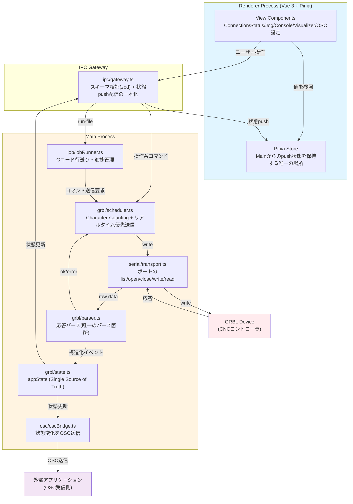

# Gcode Tracer 要件定義書

## 0. このドキュメントの位置づけ

本書は、GRBL Gコードセンダーアプリケーション「Gcode Tracer」の要件定義書である。

- プロジェクト名: **Gcode Tracer**

## 1. 目的

- アーキテクチャ負債(状態管理の分散、責務の混在)を生まない、保守性の高いGRBL Gコードセンダーを構築する。
- 開発を主にAIコーディングエージェントが担うことを前提に、**エージェントが少ない文脈(コンテキスト)で安全に変更できる構造**を最優先で実現する(= コンテキスト汚染対策)。

## 2. スコープ

| 項目 | 方針 |
|---|---|
| 機能範囲 | 7章「機能要件」に定義する範囲。それ以外は対象外 |
| 対象OS | macOSのみ |
| 構築方法 | 単一リポジトリでフルスクラッチ構築する |

## 3. アーキテクチャ上避けるべき失敗パターン

設計・実装にあたり、以下のパターンを避けること:

1. GRBLステータス文字列のパースを複数箇所(Main process・Renderer双方の複数コンポーネント等)に重複させること。
2. RXバッファのCharacter-Counting管理をRenderer側に置き、Main側にコマンドキューを持たないこと。これによりJog/Console操作がバッファ計算を一切認識せず割り込めてしまう。
3. アプリケーション状態(接続状態・機械状態・座標・ジョブ進捗)の単一の保持者を持たず、各UIコンポーネントが独立に生データを解析して自分のstateを持つこと。
4. ポーリングをACKを待たないfire-and-forget方式にすること。低電力モード下でのタイマー遅延・コアレッシングと衝突しやすい。
5. UIの再レンダリングをポーリング間隔に直結させ、値が変化していなくても再レンダリングが発生する構成にすること。
6. デザインシステムを持たず、色・スペーシングをコンポーネントごとにハードコードすること。CSS設定の混在や未使用の死んだCSSも避ける。
7. テストを一切持たないこと。

## 4. 技術スタック

| レイヤ | 技術 | 備考 |
|---|---|---|
| アプリ基盤 | Electron | Main/Rendererのプロセス分離を採用 |
| Renderer フレームワーク | **Vue 3 (Composition API)** | 細粒度リアクティビティにより「値が変わらなければ再描画しない」を素で満たし、3章の項目5の回避に直接寄与する |
| 言語 | TypeScript | Main/Renderer双方 |
| ビルド | Vite + **electron-builder** | Vite でJS/CSS生成、electron-builder でmacOS `.app` パッケージ化。`npm run package` で一括実行 |
| 状態管理(Renderer) | **Pinia** | Vue標準の状態管理。Mainからpushされる状態を1つのストアに集約し、各コンポーネントは必要なプロパティだけを参照する |
| スタイリング | **Vanilla CSS + CSS Modules** | ユーティリティCSSフレームワークは採用しない。Vue SFCの`<style module>`または`scoped`を利用 |
| シリアル通信 | `serialport` | macOS限定のため採用リスクは低い |
| OSC送信 | `osc` | |
| IPCスキーマ検証 | **zod** | IPC境界を通る全メッセージを検証する手段として |
| テスト | **Vitest** | Vite前提のため自然な選択 |

## 5. システム全体像

3章の方針に基づき、以下のようにモジュールを分割する。



## 6. アーキテクチャ方針

### 6.1 基本原則(コンテキスト汚染対策)

- **状態の単一所有者**: GRBLのプロトコル知識・機械状態は Main process の1モジュールのみが保持する。Rendererは状態を「保持」せず「表示」するだけ。
- **モジュールは単責務・小ファイル**: 1モジュール1責務。エージェントが1ファイルだけ読めば安全に変更できる範囲にとどめる。
- **境界をまたぐ通信は1箇所に集約**: Main⇄Renderer間のやり取りはIPC Gatewayの1モジュールのみが扱う。
- **直接アクセスの禁止**: シリアルポートへの書き込みは必ずSchedulerを経由する(Jog・コンソール・ジョブ実行のいずれも例外なし)。

### 6.2 Main process モジュール構成

```
electron/
  serial/
    transport.ts     ポートのlist/open/close/write/readのみ。GRBL構文を一切知らない
  grbl/
    parser.ts        受信した生データ→構造化イベント(ok/error/status/alarm/feedback/welcome)への変換。唯一のパース箇所
    state.ts          parser.tsのイベントを集約しappStateを保持する唯一の場所(Single Source of Truth)
    scheduler.ts      Character-Counting方式のコマンドキュー + リアルタイムコマンドの優先送信
  job/
    jobRunner.ts      Gコードファイルの行送り・一時停止/再開/キャンセル・進捗追跡。scheduler.ts経由でのみ送信
  osc/
    oscBridge.ts      state.tsの更新を購読しOSC送信するのみ
  ipc/
    gateway.ts        Renderer⇄Mainの唯一の境界。スキーマ検証、状態のpush配信を一本化
```

**リアルタイムコマンド**(`?` ステータスクエリ, `~` サイクル開始/再開, `!` フィード保持, `0x18`/Ctrl-X ソフトリセット)は`scheduler.ts`内でキューをバイパスし即座に送信する。通常コマンドはGRBL既定のRXバッファ(127バイト)を前提にCharacter-Countingで管理する。

**`cancel()` とソフトリセット（`app.ts`）**

`cancel()` ハンドラは `jobRunner.cancel()` に加えて `scheduler.softReset()` を呼ぶ。これはジョブを Feed Hold（`!`）で一時停止した状態でキャンセルした場合に GRBL が Hold 状態のままになるのを防ぐためである。ソフトリセット（Ctrl-X）をモーション実行中の GRBL に送ると、GRBL は `ALARM:8 Abort during cycle` を返した後にウェルカムメッセージを送信し、Alarm 状態へ遷移する。この `ALARM:8` は `grbl/state.ts` で `hasError = true` に反映される。なお `cancel()` はコンソールに tx 行を追記しない（`softReset()` ハンドラとは異なる）。

> エラーコード(`error:N`)の人間可読化(`grbl/errors.ts`)に関する提案の詳細は、13章「残課題」にまとめる。

### 6.3 Renderer構成方針

- Mainからpushされた状態を1つのPiniaストアに集約。
- 各コンポーネントはストアから必要な値のみを参照(Vueのリアクティビティにより、参照していない値の変化では再描画されない)。
- コンポーネントはシリアル生データの直接パースを禁止。表示とユーザー操作のディスパッチのみ。

### 6.4 IPC契約

- Main→Renderer: state.tsの状態を1本のチャンネル(`stateChanged`)でpush配信する(複数イベント種別をコンポーネント側で個別購読する形は採用しない)。
- Renderer→Main: ユーザー操作をdispatchするのみ。
- 全メッセージをスキーマ検証(zod)し、型不一致・不正値をMain側で確実に拒否する。
- 機械状態に属さないウィンドウイベント（フルスクリーン切り替えなど）は専用チャンネルで個別push可。現在実装済み: `fullscreenChanged`（`boolean`）。

**Renderer → Main(ユーザー操作のdispatch)**

```ts
type RendererToMainMessage =
  | { type: 'connect'; path: string; baudRate: number }
  | { type: 'disconnect' }
  | { type: 'send-command'; command: string }
  | { type: 'jog'; x: number; y: number; z: number; stepSize: number }
  | { type: 'zero'; axis: 'X' | 'Y' | 'Z' }
  | { type: 'goto-work-zero' }
  | { type: 'home' }
  | { type: 'unlock' }
  | { type: 'soft-reset' }
  | { type: 'run-file'; lines: string[]; startLine: number }  // startLine: 再開開始行（0=先頭）
  | { type: 'pause' }
  | { type: 'resume' }
  | { type: 'cancel' }
  | { type: 'set-poll-interval'; ms: number }
  | { type: 'update-osc-settings'; ip: string; port: number; enabled: boolean }
```

**Main → Renderer(状態の単一push、例)**

```ts
interface AppState {
  connection: { connected: boolean; port: string | null; baudRate: number }
  grbl: {
    machineState: 'Idle' | 'Run' | 'Hold' | 'Alarm' | 'Door' | 'Home' | 'Check' | 'Unknown'
    mpos: { x: number; y: number; z: number }
    wpos: { x: number; y: number; z: number }
  }
  job: { running: boolean; paused: boolean; currentLine: number; sentLine: number; totalLines: number }
  osc: { ip: string; port: number; enabled: boolean }
  console: {
    lines: ConsoleLine[]  // 最大500行（超過分は先頭から削除）
    hasError: boolean     // error:/ALARM: 行が存在するとtrue。アンロック($X)後にfalseへリセット
  }
}
```

フィードレート/スピンドル速度は本フェーズの`AppState`には含めない(スコープ外)。`grbl/parser.ts`がステータス報告の`FS:`フィールドを内部的に保持すること自体は妨げないが、UIへの露出は対象外とする。

**`console.hasError` の管理ルール（`grbl/state.ts`）**

- `error:N` / `ALARM:N` の受信行を `appendConsoleLine` に追加する際 `isError = true` フラグを立てる → `hasError = true`
- ステータス報告（`status`イベント）で `machineState` が `Alarm` → 非`Alarm` へ遷移したとき → `hasError = false`（`$X` アンロック成功を検出）
- 情報メッセージ（`info` direction）や welcome メッセージはエラー扱いしない

**Renderer側 Pinia ストア更新の注意点**

`applyState` で各スライスを更新する際、`console` スライスは `Object.assign(consoleState, next.console)` のように**全フィールドをまとめて代入**すること。特定フィールド（`lines` のみ等）に絞ると `hasError` など新たに追加したフィールドが反映されないバグになる。

### 6.5 データフロー例

**Gコードファイル実行**

1. Renderer: ファイル選択・読み込み。可視化用にツールパスを生成(表示のみ、送信ロジックとは独立)
2. Renderer → Gateway: `run-file` をdispatch(Gコード行配列)
3. Gateway → `job/jobRunner.ts`: ジョブ開始
4. `job/jobRunner.ts` → `grbl/scheduler.ts`: 全行を `enqueue`（各行に `onComplete` / `onSend` コールバックを登録）
5. `grbl/scheduler.ts`: バッファ残量を確認しTransportへwrite。write直後に `onSend` を呼び出す
6. `job/jobRunner.ts`: `onSend` が呼ばれるたびに `sentLine`（実際に送信した行数）を更新 → Rendererへpush
7. GRBL: `ok` 応答
8. `grbl/parser.ts`: `ok`を検出 → `grbl/scheduler.ts`にバッファ解放を通知
9. `grbl/scheduler.ts`: 次のキュー行をwrite（`onSend` が再び呼ばれ `sentLine` が進む）
10. `grbl/state.ts`: 進捗(`currentLine` / `sentLine` / `totalLines`)を更新 → Gateway経由でRendererへpush
11. 7〜10を繰り返し、完了・エラー・キャンセルで`job/jobRunner.ts`が終了処理

**ステータス監視と外部送信**

1. `grbl/scheduler.ts`: リアルタイムコマンド`?`をACKベースで送信(前回応答受信後、または間隔補正つきで送信。固定intervalのfire-and-forgetは行わない)
2. GRBL: `<Idle|MPos:0.000,0.000,0.000|...>` 応答
3. `grbl/parser.ts`: パースして構造化イベントを発行
4. `grbl/state.ts`: appStateを更新
5. `grbl/state.ts` → `ipc/gateway.ts`: 変更があった場合のみ・間引いてpush
6. `grbl/state.ts` → `osc/oscBridge.ts`: 位置情報をOSC送信(Renderer描画レートと独立して動作させる)

## 7. 機能要件

実装すべき機能要件は以下の通り:

- シリアルポート接続/切断、ポート一覧取得、ボーレート選択
- ステータスポーリング(間隔設定可能)と状態表示(機械状態・MPos/WPos)
- コンソール(コマンド送信・ログ表示)
- ジョグ操作(XY/Z、ステップサイズ可変)、ホーミング、ソフトリセット、アンロック
- 座標ゼロ設定(G10 L20)、ワークゼロへの移動
- Gコードファイル読み込み・Character-Counting方式での送信・一時停止/再開/キャンセル・進捗表示
- ジョブ途中停止からの指定行再開（`startLine` パラメータで再開位置を指定）
- 新ファイル読み込み時に実行中ジョブを自動キャンセルしてリセット
- Gコード可視化(ツールパス描画、ズーム/パン、現在位置表示)
- Gコード軌跡プレビュー（スライダー操作・一コマンド前後移動でツールパスを疑似再生）
- Gコードテキストパネル（右サイドパネル・シンタックスハイライト・行クリックでプレビュー連動・ジョブ実行中の現在行ハイライト・テキスト検索 `⌘F`・行番号ジャンプ・行範囲フィルター）
- OSC送信設定(IP/ポート/有効化)と位置情報送信

## 8. 非機能要件

### 8.1 パフォーマンス

- ポーリングはACKベース(前回の`?`応答を受け取るまで次を送らない、または応答有無に応じて間隔を補正する)とし、固定`setInterval`のfire-and-forgetを避ける。
- ステータス文字列のパースはMain process側の`parser.ts`のみで行い、Renderer側での重複パースを禁止する。
- UIの再描画レートとシリアルポーリングレートを分離する(ポーリングは高頻度でよいが、UI更新は人間が視認可能な頻度に間引く)。
- 上記により、低電力モード等でCPU予算が縮小した場合の耐性を確保する。

### 8.2 セキュリティ

- `contextIsolation: true` / `nodeIntegration: false` / `sandbox: true` を明示的に設定する(デフォルト依存にしない)。
- IPC Gatewayで全入力を検証する。

### 8.3 保守性

- 各Main processモジュールは外部依存を注入可能にし、単体テスト可能な形にする。
- private内部状態への外部からの直接アクセス(例: モジュールが保持するprivateプロパティを、呼び出し側が`module['internalProp']`のような形で読み書きする実装)を禁止する。

### 8.4 大容量ファイル対応

- Gコードファイルの読み込み・実行は、全行を配列としてメモリに保持する方式でよい。ただし読み込み処理がUIスレッドをブロックしないこと。
- GcodeTextPanel は仮想スクロールを実装し、1万行超のファイルでも DOM に存在する行数を常時 ~40 行に抑える。行の高さを 22px に固定し、`paddingTop` / `paddingBottom` でスクロール量を維持する。
- リサイズハンドルのドラッグ中は Vue のリアクティブ ref を更新せず DOM を直接操作し、`pointerup` 時に一度だけ ref を同期する（大量 DOM 要素を持つパネルでの再描画コストを排除）。

## 9. デザインシステム要件

- 色・スペーシング・タイポグラフィをCSS変数によるトークンとして一元管理し、コンポーネント側は生の値を直接書かない。
- 未使用CSSを残さない(コンポーネントの変更・削除に伴い、参照されなくなったスタイル定義を放置しない)。
- **Apple Human Interface Guideline(HIG)を参考にする**。macOS専用アプリのため、ライトモード/ダークモードをシステム設定(`prefers-color-scheme`)に追従させる。

### 9.1 ベーストークン(確定)

| トークン | 値 | 用途 |
|---|---|---|
| `--color-white` | `#FAFAF7` | ライトモード基調背景色 |
| `--color-black` | `#191919` | ダークモード基調背景色 |
| `--color-accent` | `#0fd140` | ブランド/アクセントカラー。ライト/ダーク共通 |
| `--font-sans` | IBM Plex Sans | UI全般 |
| `--font-mono` | IBM Plex Mono | コンソール・座標値など、場合に応じて使用 |

### 9.2 派生トークン(確定)

ベース3色だけでは境界線・セカンダリテキスト・警告/エラー表示が表現できないため、以下を定義する。

| トークン | ライトモード | ダークモード | 用途 |
|---|---|---|---|
| `--color-surface` | `#FFFFFF` | `#222222` | パネル等、背景より一段上の面 |
| `--color-text-primary` | `#191919` | `#FAFAF7` | 主要テキスト |
| `--color-text-secondary` | `#6E6E6E` | `#9A9A9A` | 補助テキスト・ラベル |
| `--color-border` | `#DEDEDA` | `#3A3A3A` | 区切り線・枠線 |
| `--color-danger` | `#D92D20` | `#E73427` | GRBL Alarm状態・エラー表示 |
| `--color-warning` | `#C77A1F` | `#F5A623` | GRBL Hold状態・警告表示 |

- GRBLの状態表示は `Idle`=ニュートラル(secondaryテキスト相当)、`Run`=`--color-accent`、`Hold`=`--color-warning`、`Alarm`=`--color-danger` に対応させる案。
- アクセントカラーをコントラスト的に成立させる必要がある箇所(ライト背景上の小さいテキストなど)は、`--color-accent`をそのまま流用せず、輝度調整したバリアント(例: `--color-accent-text`)を別途定義する可能性がある。実装時にコントラスト比を確認する。

## 10. テスト戦略

- 必須: `grbl/parser.ts`(プロトコル解析)、`grbl/scheduler.ts`(バッファ計算・優先送信)のユニットテスト。
- テスト用に、実GRBLデバイスの代わりにGRBL応答を模したモックTransport(文字列ベースで`ok` / `error:N` / ステータス報告を返すスタブ)を用意し、実機なしで`parser.ts`/`scheduler.ts`/`jobRunner.ts`を検証できるようにする。
- 任意: その他モジュールは段階的に追加。
- E2E/実機テストは将来検討事項とし、本フェーズの必須要件にはしない。

## 11. ドキュメント規約

- 主要モジュールディレクトリ(`serial/`, `grbl/`, `job/`, `osc/`, `ipc/`)に短い責務メモ(README.mdまたはCLAUDE.md)を置き、「このモジュールの責務」「やってはいけないこと(不変条件)」を明文化する。
- 目的: エージェントがディレクトリ単位の文脈だけで安全に変更できるようにすること。

## 12. 実装優先順位

依存関係の少ない順に実装する。

### Phase 1: 基盤
1. `serial/transport.ts`(ポート接続/切断/一覧取得)
2. `grbl/parser.ts` + `grbl/state.ts`(応答パースと状態保持の最小実装)
3. `ipc/gateway.ts`(状態push配信の一本化)
4. 接続パネル・ステータス表示パネル(Vue + Pinia購読の最小UI)

### Phase 2: コマンド送信
5. `grbl/scheduler.ts`(Character-Counting + リアルタイムコマンド優先送信)
6. コンソールUI(コマンド入力・ログ表示)

### Phase 3: ジョブ実行
7. `job/jobRunner.ts`(Gコードファイル送信・進捗管理)
8. 一時停止/再開/キャンセル
9. Gコード可視化(ツールパス描画)

### Phase 4: 周辺機能
10. ジョグ操作・ホーミング・ゼロ設定UI
11. `osc/oscBridge.ts` + OSC設定UI
12. デザインシステム(9章のトークン)を全コンポーネントへ適用

## 13. 残課題

- リポジトリの配置場所は、作成時に決定する。
- `grbl/parser.ts`が検出する`error:N`を人間可読な説明文に変換する辞書(`grbl/errors.ts`、6.2章参照)を用意する提案がある。エラー表示の精度向上を目的とした提案であり、要否は未確定。異論があれば対象外にする。
- 本書の要件定義は以上で確定。実装フェーズへ移行可能。

## 14. 参考リソース

- [GRBL Wiki](https://github.com/gnea/grbl/wiki)
- [GRBL v1.1 Interface(プロトコル仕様)](https://github.com/gnea/grbl/wiki/Grbl-v1.1-Interface)
- [Electron IPC](https://www.electronjs.org/docs/latest/tutorial/ipc)
- [Node SerialPort](https://serialport.io/)
- [OSC Protocol](http://opensoundcontrol.org/)
- [Vue 3 (Composition API)](https://vuejs.org/)
- [Pinia](https://pinia.vuejs.org/)
- [Zod](https://zod.dev/)
- [Vitest](https://vitest.dev/)
- [Apple Human Interface Guidelines](https://developer.apple.com/design/human-interface-guidelines/)
